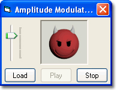

## Sound Amplitude Modulation

### Description

Visual Sound Amplitude Modulation.

An example of determining amplitude whilst playing and processing a sound file buffer using and instance of DirectX 8's DirectSound8 class.

Amplitude modulation is displayed by use of a Slider Active-X Control, and by displaying a sequence of images whose image reflects the current amplitutde of the sample being processed.

This project was requested by PSCode user: Maxwolf. The 'Devil' character images are property of his company, when he requested the project he also transmitted these image files to me so that I could incorporate these images in the example. You may not re-use these images in you're own application without his written consent. If you wish to contact 'Maxwolf', you may do so via e-mail: maxwolf@columbus.rr.com
 
### More Info
 

             |
---                |---
**Submitted On**   |2003-03-15 18:56:16
**By**             |[Alex Smoljanovic\(aLeX^rS\)](https://github.com/Planet-Source-Code/PSCIndex/blob/master/ByAuthor/alex-smoljanovic-alex-rs.md)
**Level**          |Intermediate
**User Rating**    |5.0 (10 globes from 2 users)
**Compatibility**  |VB 5\.0, VB 6\.0
**Category**       |[Sound/MP3](https://github.com/Planet-Source-Code/PSCIndex/blob/master/ByCategory/sound-mp3__1-45.md)
**World**          |[Visual Basic](https://github.com/Planet-Source-Code/PSCIndex/blob/master/ByWorld/visual-basic.md)
**Archive File**   |[Sound\_Ampl1560173152003\.zip](https://github.com/Planet-Source-Code/alex-smoljanovic-alex-rs-sound-amplitude-modulation__1-44037/archive/master.zip)

